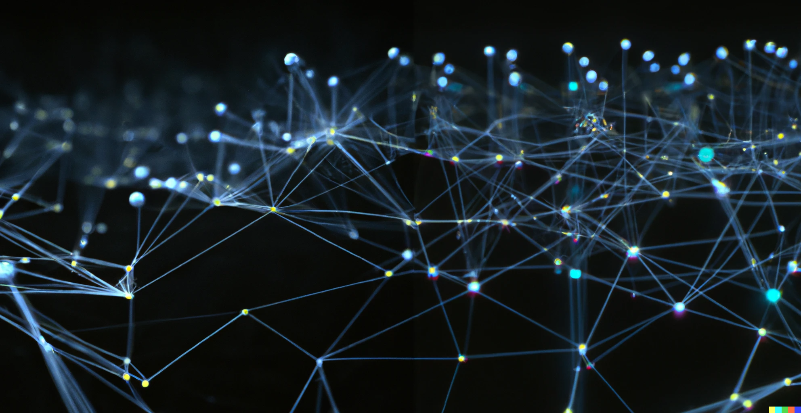
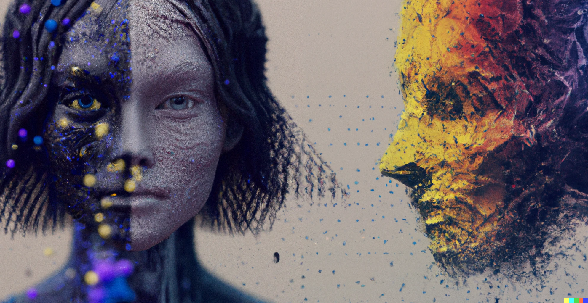

> As a **freelance AI professional**, I am committed to helping organizations achieve their goals through the effective use of **artificial intelligence**. I offer a range of services to support the **strategy** and **execution** of AI plans, including team and **project management**, ML model development, data processing, **cloud** environment setup, **MLOps** pipelines, and architecture design.

# What I can do for you

As a seasoned AI professional with a wide range of **experience** in **consulting**, **research**, **product development**, and **prototyping**, I am well-equipped to support organizations in their efforts to leverage artificial intelligence. In addition to offering consultation on **AI strategy**, I am skilled in the following areas:

* ML Model development
* Project management
* Solution architecture
* Data pipeline development
* Backend development

As a **technical leader** with a track record of effectively organizing and **managing** multidisciplinary teams, I can help your organization optimize the work of your team and drive meaningful results through the use of AI. Let's work together to achieve your goals and unlock the full potential of this powerful technology.

# Why you need me for your AI strategy

Hiring a freelancer AI professional like myself can bring you a number of benefits. First and foremost, I bring a wealth of knowledge and experience to the table: I have a deep understanding of the various approaches and techniques that can be used to successfully implement AI initiatives. This allows me to provide valuable guidance and support to organizations as they navigate the complex landscape of AI.

